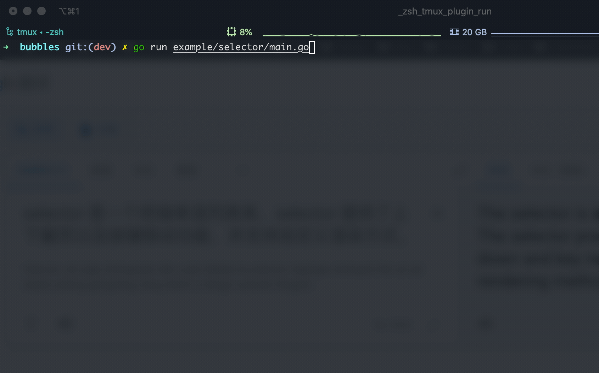
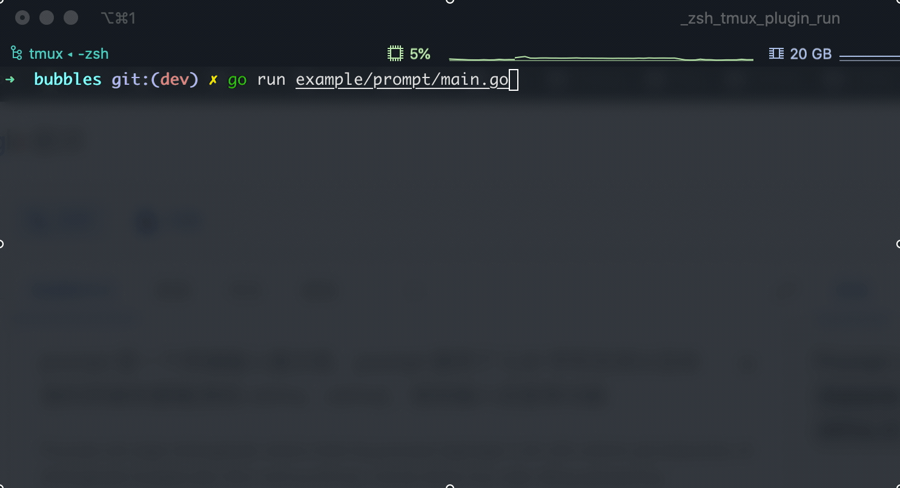

# bubbles

bubbles is a terminal prompt library created based on [charmbracelet/bubbletea](https://github.com/charmbracelet/bubbletea). 
Based on bubbletea, it can be more robust and easy to maintain. Now bubbles are
used to replace [promptx](https://github.com/mritd/promptx). Currently bubbles only contains two components: `selector` and `prompt`.

### selector

The `selector` is a terminal single-selection list library. The `selector` library provides the functions 
of page up and down and key movement, and supports custom rendering methods.

### prompt

The `prompt` is a terminal input prompt library. The `prompt` library provides CJK character support 
and standard terminal shortcut keys (such as `ctrl+a`, `ctrl+e`), password input echo and other functions.

